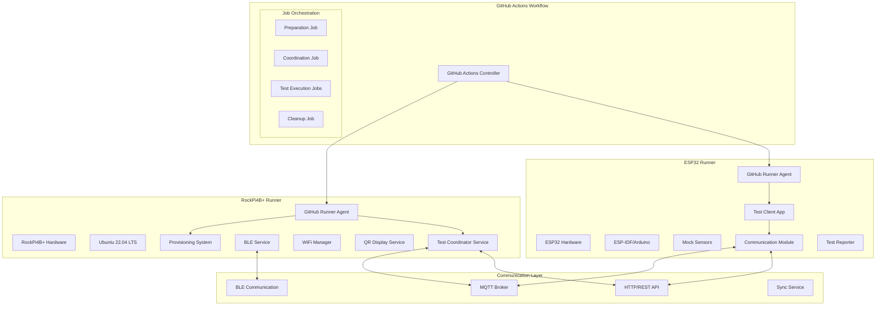

# 🚀 ESP32 + RockPi4B+ Dual Runner GitHub Actions Architecture

## 📋 Executive Summary

This document outlines the architecture and implementation strategy for a GitHub Actions pipeline that utilizes two local self-hosted runners:
- **RockPi4B+**: Primary server/coordinator running the digital signage provisioning system
- **ESP32**: Test device/client that connects and communicates with the RockPi4B+

This setup enables automated end-to-end testing that simulates real-world IoT device interactions in a controlled CI/CD environment.

## 🏗️ Architecture Overview

### System Components



### Communication Flow

1. **GitHub Actions** triggers workflow
2. **RockPi4B+** starts provisioning system and test coordinator
3. **ESP32** initializes test client and waits for instructions
4. **Test Coordinator** synchronizes both devices
5. **ESP32** executes test scenarios (WiFi connection, data transmission, BLE pairing)
6. **RockPi4B+** validates responses and system behavior
7. **Both devices** report results back to GitHub Actions

## 🔧 Hardware Requirements

### RockPi4B+ Specifications

| Component | Requirement | Purpose |
|-----------|-------------|---------|
| **CPU** | OP1 dual Cortex-A72@2.0GHz + quad Cortex-A53@1.5GHz | Run provisioning system + test coordinator |
| **Memory** | 4GB LPDDR4 minimum | Handle concurrent services and test execution |
| **Storage** | 32GB eMMC/SD card minimum | OS, applications, test data, logs |
| **WiFi** | 802.11ac dual-band | WiFi provisioning testing |
| **Bluetooth** | BLE 5.0 | BLE provisioning testing |
| **Ethernet** | Gigabit | Stable GitHub Actions connectivity |
| **HDMI** | HDMI 2.0 | QR code display testing |
| **GPIO** | 40-pin header | Hardware control and status indication |
| **USB** | USB 3.0 ports | Additional peripherals |

### ESP32 Specifications

| Component | Requirement | Purpose |
|-----------|-------------|---------|
| **MCU** | ESP32-WROOM-32 or ESP32-S3 | Test client execution |
| **Memory** | 520KB SRAM, 4MB Flash minimum | Application and test data |
| **WiFi** | 802.11 b/g/n 2.4GHz | WiFi connection testing |
| **Bluetooth** | BLE 4.2+ / 5.0 | BLE communication testing |
| **GPIO** | 30+ pins available | Sensor simulation, status LEDs |
| **Power** | USB or external 3.3V | Stable operation during tests |
| **Peripherals** | I2C, SPI, UART | Sensor simulation |

## 📚 Software Architecture

### RockPi4B+ Software Stack

```yaml
Operating System: Ubuntu 22.04 LTS ARM64
Runtime Environment:
  - Python 3.9+
  - Node.js 18+ (for MQTT broker)
  - Docker (optional, for containerized services)

Core Services:
  - Digital Signage Provisioning System (existing)
  - GitHub Actions Runner Agent
  - Test Coordinator Service (new)
  - MQTT Broker (Mosquitto)
  - HTTP API Server (FastAPI)
  - BLE Manager Service
  - WiFi Manager Service
  - QR Display Service

Dependencies:
  - bleak (BLE communication)
  - paho-mqtt (MQTT client)
  - fastapi (HTTP API)
  - uvicorn (ASGI server)
  - psutil (system monitoring)
  - pytest (testing framework)
```

### ESP32 Software Stack

```yaml
Runtime Environment:
  - ESP-IDF v5.1+ or Arduino ESP32 Core
  - FreeRTOS (built-in)
  - GitHub Actions Runner (lightweight custom implementation)

Core Components:
  - Test Client Application (new)
  - MQTT Client Library
  - HTTP Client Library
  - BLE Client Library
  - WiFi Manager
  - Sensor Simulator
  - Test Reporter

Libraries:
  - PubSubClient (MQTT)
  - ArduinoHttpClient (HTTP requests)
  - ESP32-BLE-Arduino (BLE communication)
  - ArduinoJson (JSON processing)
  - WiFi (built-in)
```

## 🔄 Test Automation Strategy

### Test Categories and Scenarios

#### 1. WiFi Provisioning Tests
```yaml
Scenario: ESP32_WiFi_Provisioning
Description: ESP32 attempts to connect to RockPi4B+ via BLE for WiFi provisioning
Steps:
  1. RockPi4B+ starts in provisioning mode
  2. ESP32 scans for BLE advertisements
  3. ESP32 connects to RockPi4B+ BLE service
  4. ESP32 sends WiFi credentials
  5. RockPi4B+ validates and connects to WiFi
  6. ESP32 verifies successful provisioning
  7. Both devices report test results

Duration: ~2-3 minutes
Success Criteria:
  - BLE connection established
  - WiFi credentials transmitted successfully
  - RockPi4B+ connects to specified network
  - Provisioning status correctly reported
```

#### 2. QR Code Provisioning Tests
```yaml
Scenario: ESP32_QR_Provisioning
Description: ESP32 simulates QR code scanning for provisioning
Steps:
  1. RockPi4B+ displays QR code on HDMI output
  2. ESP32 receives QR code data via HTTP API (simulating camera scan)
  3. ESP32 processes QR code and extracts WiFi credentials
  4. ESP32 reports successful QR code processing
  5. RockPi4B+ validates QR display and response

Duration: ~1-2 minutes
Success Criteria:
  - QR code generated and displayed correctly
  - ESP32 receives and parses QR data
  - WiFi credentials extracted accurately
```

#### 3. Device Communication Tests
```yaml
Scenario: ESP32_Data_Transmission
Description: ESP32 sends sensor data to RockPi4B+ after provisioning
Steps:
  1. Both devices complete provisioning
  2. ESP32 generates mock sensor data
  3. ESP32 transmits data via MQTT/HTTP
  4. RockPi4B+ receives and validates data
  5. RockPi4B+ responds with acknowledgment
  6. ESP32 verifies response received

Duration: ~1 minute
Success Criteria:
  - Data transmission successful
  - Data integrity maintained
  - Response received within timeout
  - Error handling works correctly
```

#### 4. Factory Reset Tests
```yaml
Scenario: ESP32_Factory_Reset
Description: ESP32 triggers and validates factory reset functionality
Steps:
  1. System in provisioned state
  2. ESP32 sends factory reset command
  3. RockPi4B+ clears stored credentials
  4. RockPi4B+ returns to provisioning mode
  5. ESP32 verifies reset successful
  6. ESP32 attempts re-provisioning

Duration: ~2-3 minutes
Success Criteria:
  - Factory reset command processed
  - Credentials cleared successfully
  - System returns to initial state
  - Re-provisioning works correctly
```

#### 5. Error Recovery Tests
```yaml
Scenario: ESP32_Error_Recovery
Description: ESP32 tests system resilience and error handling
Steps:
  1. ESP32 introduces various error conditions
  2. Network disconnections
  3. Invalid credential attempts
  4. Communication timeouts
  5. RockPi4B+ handles errors gracefully
  6. ESP32 validates error responses

Duration: ~3-5 minutes
Success Criteria:
  - Errors handled without system crash
  - Appropriate error messages returned
  - System recovers to stable state
  - Logging captures error details
```

### Test Execution Matrix

| Test Category | RockPi4B+ Role | ESP32 Role | Communication | Duration |
|---------------|-----------------|------------|---------------|----------|
| BLE Provisioning | BLE Server | BLE Client | Direct BLE | 2-3 min |
| QR Provisioning | QR Generator | QR Scanner (sim) | HTTP API | 1-2 min |
| Data Transmission | Data Receiver | Data Sender | MQTT/HTTP | 1 min |
| Factory Reset | Reset Handler | Reset Trigger | BLE/HTTP | 2-3 min |
| Error Recovery | Error Handler | Error Generator | Various | 3-5 min |

## 🚀 GitHub Actions Pipeline Design

### Workflow Structure

```yaml
name: 🔄 ESP32 + RockPi4B+ Integration Tests

on:
  push:
    branches: [ main, develop ]
  pull_request:
    branches: [ main ]
  schedule:
    - cron: '0 2 * * *'  # Daily at 2 AM
  workflow_dispatch:
    inputs:
      test_scope:
        description: 'Test scope'
        required: true
        default: 'standard'
        type: choice
        options:
          - quick       # Essential tests only
          - standard    # Standard test suite
          - full        # Complete test suite
          - stress      # Stress testing

jobs:
  # ============================================================================
  # PREPARATION AND VALIDATION
  # ============================================================================
  prepare-environment:
    name: 🔧 Environment Preparation
    runs-on: ubuntu-latest
    outputs:
      test-matrix: ${{ steps.matrix.outputs.matrix }}
      runners-available: ${{ steps.runners.outputs.available }}
    
    steps:
    - name: 📥 Checkout Code
      uses: actions/checkout@v4
    
    - name: 🔍 Check Runner Availability
      id: runners
      run: |
        # Check if both runners are online
        ROCKPI_AVAILABLE=$(curl -s -H "Authorization: token ${{ secrets.GITHUB_TOKEN }}" \
          "https://api.github.com/repos/${{ github.repository }}/actions/runners" \
          | jq '.runners[] | select(.labels[].name == "rockpi4b-plus") | .status' | grep -c "online" || echo "0")
        
        ESP32_AVAILABLE=$(curl -s -H "Authorization: token ${{ secrets.GITHUB_TOKEN }}" \
          "https://api.github.com/repos/${{ github.repository }}/actions/runners" \
          | jq '.runners[] | select(.labels[].name == "esp32") | .status' | grep -c "online" || echo "0")
        
        if [ "$ROCKPI_AVAILABLE" -gt 0 ] && [ "$ESP32_AVAILABLE" -gt 0 ]; then
          echo "available=true" >> $GITHUB_OUTPUT
          echo "✅ Both runners are available"
        else
          echo "available=false" >> $GITHUB_OUTPUT
          echo "❌ One or more runners offline"
          echo "RockPi4B+: $ROCKPI_AVAILABLE, ESP32: $ESP32_AVAILABLE"
        fi
    
    - name: 📋 Generate Test Matrix
      id: matrix
      run: |
        case "${{ github.event.inputs.test_scope }}" in
          "quick")
            MATRIX='["ble_provisioning", "data_transmission"]'
            ;;
          "standard")
            MATRIX='["ble_provisioning", "qr_provisioning", "data_transmission", "factory_reset"]'
            ;;
          "full")
            MATRIX='["ble_provisioning", "qr_provisioning", "data_transmission", "factory_reset", "error_recovery"]'
            ;;
          "stress")
            MATRIX='["stress_ble", "stress_data", "stress_recovery"]'
            ;;
          *)
            MATRIX='["ble_provisioning", "data_transmission"]'
            ;;
        esac
        echo "matrix=$MATRIX" >> $GITHUB_OUTPUT

  # ============================================================================
  # DEVICE COORDINATION
  # ============================================================================
  coordinate-devices:
    name: 🎯 Device Coordination
    needs: prepare-environment
    if: needs.prepare-environment.outputs.runners-available == 'true'
    runs-on: ubuntu-latest
    
    outputs:
      session-id: ${{ steps.session.outputs.session-id }}
      coordination-token: ${{ steps.token.outputs.token }}
    
    steps:
    - name: 📝 Generate Test Session
      id: session
      run: |
        SESSION_ID="test-$(date +%Y%m%d-%H%M%S)-${{ github.run_id }}"
        echo "session-id=$SESSION_ID" >> $GITHUB_OUTPUT
        echo "Generated session ID: $SESSION_ID"
    
    - name: 🔑 Generate Coordination Token
      id: token
      run: |
        TOKEN=$(openssl rand -hex 16)
        echo "token=$TOKEN" >> $GITHUB_OUTPUT
        echo "Generated coordination token"
    
    - name: 📊 Create Test Manifest
      run: |
        cat > test-manifest.json << EOF
        {
          "session_id": "${{ steps.session.outputs.session-id }}",
          "coordination_token": "${{ steps.token.outputs.token }}",
          "test_matrix": ${{ needs.prepare-environment.outputs.test-matrix }},
          "created_at": "$(date -u +%Y-%m-%dT%H:%M:%SZ)",
          "github_run_id": "${{ github.run_id }}",
          "github_run_number": "${{ github.run_number }}",
          "commit_sha": "${{ github.sha }}"
        }
        EOF
        
        echo "📋 Test Manifest Created:"
        cat test-manifest.json
    
    - name: 📤 Upload Test Manifest
      uses: actions/upload-artifact@v4
      with:
        name: test-manifest
        path: test-manifest.json
        retention-days: 7

  # ============================================================================
  # ROCKPI4B+ PREPARATION
  # ============================================================================
  prepare-rockpi:
    name: 🏠 Prepare RockPi4B+
    needs: [prepare-environment, coordinate-devices]
    runs-on: [self-hosted, rockpi4b-plus]
    if: needs.prepare-environment.outputs.runners-available == 'true'
    timeout-minutes: 10
    
    steps:
    - name: 📥 Checkout Code
      uses: actions/checkout@v4
    
    - name: 📥 Download Test Manifest
      uses: actions/download-artifact@v4
      with:
        name: test-manifest
    
    - name: 🔧 Setup Environment
      run: |
        echo "🔧 Setting up RockPi4B+ test environment..."
        
        # Load test manifest
        export TEST_SESSION_ID=$(jq -r '.session_id' test-manifest.json)
        export COORDINATION_TOKEN=$(jq -r '.coordination_token' test-manifest.json)
        
        echo "Session ID: $TEST_SESSION_ID"
        echo "TEST_SESSION_ID=$TEST_SESSION_ID" >> $GITHUB_ENV
        echo "COORDINATION_TOKEN=$COORDINATION_TOKEN" >> $GITHUB_ENV
        
        # Verify hardware capabilities
        echo "📊 Hardware Information:"
        echo "Model: $(cat /proc/device-tree/model 2>/dev/null || echo 'Unknown')"
        echo "Memory: $(free -h | grep Mem | awk '{print $3 "/" $2}')"
        echo "Bluetooth: $(bluetoothctl --version 2>/dev/null || echo 'Not available')"
        echo "WiFi: $(iwconfig 2>/dev/null | grep -c 'IEEE 802.11' || echo '0') interfaces"
    
    - name: 🔧 Install Dependencies
      run: |
        # Install/update Python dependencies
        python3 -m pip install --upgrade pip
        python3 -m pip install -e ".[dev]"
        
        # Install MQTT broker if not present
        if ! command -v mosquitto &> /dev/null; then
          sudo apt update
          sudo apt install -y mosquitto mosquitto-clients
        fi
        
        # Start MQTT broker
        sudo systemctl start mosquitto
        sudo systemctl enable mosquitto
    
    - name: 🚀 Start Test Coordinator
      run: |
        echo "🚀 Starting test coordinator service..."
        
        # Create coordinator service script
        cat > start_coordinator.py << 'EOF'
#!/usr/bin/env python3
import os
import sys
import asyncio
import json
from pathlib import Path
from datetime import datetime

# Add src to path
sys.path.insert(0, str(Path(__file__).parent / "src"))

from src.testing.test_coordinator import TestCoordinator

async def main():
    session_id = os.environ.get('TEST_SESSION_ID')
    token = os.environ.get('COORDINATION_TOKEN')
    
    if not session_id or not token:
        print("❌ Missing session ID or coordination token")
        sys.exit(1)
    
    print(f"🚀 Starting test coordinator for session: {session_id}")
    
    coordinator = TestCoordinator(session_id, token)
    await coordinator.start()

if __name__ == "__main__":
    asyncio.run(main())
EOF
        
        chmod +x start_coordinator.py
        python3 start_coordinator.py &
        COORDINATOR_PID=$!
        echo "COORDINATOR_PID=$COORDINATOR_PID" >> $GITHUB_ENV
        
        # Wait for coordinator to be ready
        sleep 5
        
        # Verify coordinator is running
        if ps -p $COORDINATOR_PID > /dev/null; then
          echo "✅ Test coordinator started successfully (PID: $COORDINATOR_PID)"
        else
          echo "❌ Test coordinator failed to start"
          exit 1
        fi
    
    - name: 🔍 Health Check
      run: |
        echo "🔍 Performing health check..."
        
        # Check MQTT broker
        if mosquitto_pub -h localhost -t "health/check" -m "ping" -q 1; then
          echo "✅ MQTT broker operational"
        else
          echo "❌ MQTT broker not responding"
          exit 1
        fi
        
        # Check test coordinator API
        if curl -f http://localhost:8080/health; then
          echo "✅ Test coordinator API responding"
        else
          echo "❌ Test coordinator API not responding"
          exit 1
        fi
        
        echo "✅ RockPi4B+ ready for testing"

  # ============================================================================
  # ESP32 PREPARATION
  # ============================================================================
  prepare-esp32:
    name: 📱 Prepare ESP32
    needs: [prepare-environment, coordinate-devices]
    runs-on: [self-hosted, esp32]
    if: needs.prepare-environment.outputs.runners-available == 'true'
    timeout-minutes: 10
    
    steps:
    - name: 📥 Checkout Code
      uses: actions/checkout@v4
    
    - name: 📥 Download Test Manifest
      uses: actions/download-artifact@v4
      with:
        name: test-manifest
    
    - name: 🔧 Setup Environment
      run: |
        echo "🔧 Setting up ESP32 test environment..."
        
        # Load test manifest
        export TEST_SESSION_ID=$(jq -r '.session_id' test-manifest.json)
        export COORDINATION_TOKEN=$(jq -r '.coordination_token' test-manifest.json)
        
        echo "Session ID: $TEST_SESSION_ID"
        echo "TEST_SESSION_ID=$TEST_SESSION_ID" >> $GITHUB_ENV
        echo "COORDINATION_TOKEN=$COORDINATION_TOKEN" >> $GITHUB_ENV
        
        # Verify ESP32 capabilities
        echo "📊 ESP32 Information:"
        esp32-info || echo "ESP32 info tool not available"
    
    - name: 🔧 Install Dependencies
      run: |
        # Install/update ESP32 development tools
        pip3 install --upgrade platformio
        
        # Install project dependencies
        pio lib install
    
    - name: 🔨 Build Test Client
      run: |
        echo "🔨 Building ESP32 test client..."
        
        # Build the test client firmware
        cd esp32-test-client
        pio run
        
        if [ $? -eq 0 ]; then
          echo "✅ ESP32 test client built successfully"
        else
          echo "❌ ESP32 test client build failed"
          exit 1
        fi
    
    - name: 📤 Flash Test Client
      run: |
        echo "📤 Flashing ESP32 test client..."
        
        cd esp32-test-client
        pio run --target upload
        
        if [ $? -eq 0 ]; then
          echo "✅ ESP32 test client flashed successfully"
        else
          echo "❌ ESP32 test client flash failed"
          exit 1
        fi
    
    - name: 🔍 Health Check
      run: |
        echo "🔍 Performing ESP32 health check..."
        
        # Wait for ESP32 to boot
        sleep 10
        
        # Check if ESP32 is responsive
        if pio device monitor --filter esp32_exception_decoder --exit-char 3 --timeout 5; then
          echo "✅ ESP32 responsive"
        else
          echo "❌ ESP32 not responding"
          exit 1
        fi
        
        echo "✅ ESP32 ready for testing"

  # ============================================================================
  # TEST EXECUTION
  # ============================================================================
  execute-tests:
    name: 🧪 Execute Tests
    needs: [prepare-environment, coordinate-devices, prepare-rockpi, prepare-esp32]
    runs-on: ubuntu-latest
    if: needs.prepare-environment.outputs.runners-available == 'true'
    timeout-minutes: 30
    
    strategy:
      fail-fast: false
      matrix:
        test-scenario: ${{ fromJson(needs.prepare-environment.outputs.test-matrix) }}
    
    steps:
    - name: 🧪 Execute Test Scenario
      run: |
        echo "🧪 Executing test scenario: ${{ matrix.test-scenario }}"
        
        # Trigger test execution via API calls to both devices
        SESSION_ID="${{ needs.coordinate-devices.outputs.session-id }}"
        TOKEN="${{ needs.coordinate-devices.outputs.coordination-token }}"
        
        # Start test on RockPi4B+
        curl -X POST \
          -H "Authorization: Bearer $TOKEN" \
          -H "Content-Type: application/json" \
          -d "{\"scenario\": \"${{ matrix.test-scenario }}\", \"role\": \"server\"}" \
          "http://rockpi4b-plus-runner-ip:8080/api/test/start/$SESSION_ID"
        
        # Start test on ESP32
        curl -X POST \
          -H "Authorization: Bearer $TOKEN" \
          -H "Content-Type: application/json" \
          -d "{\"scenario\": \"${{ matrix.test-scenario }}\", \"role\": \"client\"}" \
          "http://esp32-runner-ip:8080/api/test/start/$SESSION_ID"
        
        # Wait for test completion (with timeout)
        TIMEOUT=300  # 5 minutes
        ELAPSED=0
        
        while [ $ELAPSED -lt $TIMEOUT ]; do
          # Check test status
          ROCKPI_STATUS=$(curl -s "http://rockpi4b-plus-runner-ip:8080/api/test/status/$SESSION_ID" | jq -r '.status')
          ESP32_STATUS=$(curl -s "http://esp32-runner-ip:8080/api/test/status/$SESSION_ID" | jq -r '.status')
          
          if [ "$ROCKPI_STATUS" = "completed" ] && [ "$ESP32_STATUS" = "completed" ]; then
            echo "✅ Test completed successfully"
            break
          elif [ "$ROCKPI_STATUS" = "failed" ] || [ "$ESP32_STATUS" = "failed" ]; then
            echo "❌ Test failed"
            exit 1
          fi
          
          sleep 10
          ELAPSED=$((ELAPSED + 10))
        done
        
        if [ $ELAPSED -ge $TIMEOUT ]; then
          echo "❌ Test timed out"
          exit 1
        fi
    
    - name: 📊 Collect Test Results
      run: |
        echo "📊 Collecting test results..."
        
        SESSION_ID="${{ needs.coordinate-devices.outputs.session-id }}"
        
        # Download test results from both devices
        curl -o "rockpi-results-${{ matrix.test-scenario }}.json" \
          "http://rockpi4b-plus-runner-ip:8080/api/test/results/$SESSION_ID"
        
        curl -o "esp32-results-${{ matrix.test-scenario }}.json" \
          "http://esp32-runner-ip:8080/api/test/results/$SESSION_ID"
        
        # Combine results
        jq -s '.[0] + .[1]' \
          "rockpi-results-${{ matrix.test-scenario }}.json" \
          "esp32-results-${{ matrix.test-scenario }}.json" \
          > "combined-results-${{ matrix.test-scenario }}.json"
        
        echo "📋 Test Results for ${{ matrix.test-scenario }}:"
        cat "combined-results-${{ matrix.test-scenario }}.json" | jq '.'
    
    - name: 📤 Upload Test Results
      uses: actions/upload-artifact@v4
      with:
        name: test-results-${{ matrix.test-scenario }}
        path: |
          *-results-${{ matrix.test-scenario }}.json
        retention-days: 30

  # ============================================================================
  # CLEANUP AND REPORTING
  # ============================================================================
  cleanup-and-report:
    name: 🧹 Cleanup and Report
    needs: [prepare-environment, coordinate-devices, execute-tests]
    runs-on: ubuntu-latest
    if: always()
    
    steps:
    - name: 📥 Download All Results
      uses: actions/download-artifact@v4
      with:
        pattern: test-results-*
        merge-multiple: true
    
    - name: 📊 Generate Summary Report
      run: |
        echo "📊 Generating test summary report..."
        
        # Create summary report
        cat > test-summary.md << 'EOF'
# 🧪 ESP32 + RockPi4B+ Integration Test Report
        
## Test Session Information
- **Session ID**: ${{ needs.coordinate-devices.outputs.session-id }}
- **Execution Time**: $(date -u +"%Y-%m-%d %H:%M:%S UTC")
- **GitHub Run**: ${{ github.run_id }}
- **Commit**: ${{ github.sha }}
        
## Test Results Summary
        
| Test Scenario | Status | Duration | Details |
|---------------|--------|----------|---------|
EOF
        
        # Process each test result file
        for file in combined-results-*.json; do
          if [ -f "$file" ]; then
            SCENARIO=$(echo "$file" | sed 's/combined-results-\(.*\)\.json/\1/')
            STATUS=$(jq -r '.status // "unknown"' "$file")
            DURATION=$(jq -r '.duration // "unknown"' "$file")
            
            case $STATUS in
              "passed") STATUS_ICON="✅" ;;
              "failed") STATUS_ICON="❌" ;;
              *) STATUS_ICON="⚠️" ;;
            esac
            
            echo "| $SCENARIO | $STATUS_ICON $STATUS | $DURATION | [Details](#$SCENARIO) |" >> test-summary.md
          fi
        done
        
        echo "" >> test-summary.md
        echo "## Detailed Results" >> test-summary.md
        echo "" >> test-summary.md
        
        # Add detailed results for each scenario
        for file in combined-results-*.json; do
          if [ -f "$file" ]; then
            SCENARIO=$(echo "$file" | sed 's/combined-results-\(.*\)\.json/\1/')
            echo "### $SCENARIO" >> test-summary.md
            echo "" >> test-summary.md
            echo '```json' >> test-summary.md
            cat "$file" >> test-summary.md
            echo '```' >> test-summary.md
            echo "" >> test-summary.md
          fi
        done
        
        echo "📋 Test Summary Report Generated:"
        cat test-summary.md
    
    - name: 📤 Upload Summary Report
      uses: actions/upload-artifact@v4
      with:
        name: test-summary-report
        path: test-summary.md
        retention-days: 90
    
    - name: 🧹 Cleanup Remote Devices
      run: |
        echo "🧹 Cleaning up remote devices..."
        
        SESSION_ID="${{ needs.coordinate-devices.outputs.session-id }}"
        TOKEN="${{ needs.coordinate-devices.outputs.coordination-token }}"
        
        # Cleanup RockPi4B+
        curl -X POST \
          -H "Authorization: Bearer $TOKEN" \
          "http://rockpi4b-plus-runner-ip:8080/api/cleanup/$SESSION_ID" || echo "RockPi cleanup failed"
        
        # Cleanup ESP32
        curl -X POST \
          -H "Authorization: Bearer $TOKEN" \
          "http://esp32-runner-ip:8080/api/cleanup/$SESSION_ID" || echo "ESP32 cleanup failed"
        
        echo "✅ Cleanup completed"
    
    - name: 📊 Workflow Summary
      run: |
        echo "## 🚀 ESP32 + RockPi4B+ Integration Test Summary" >> $GITHUB_STEP_SUMMARY
        echo "" >> $GITHUB_STEP_SUMMARY
        echo "**Session**: ${{ needs.coordinate-devices.outputs.session-id }}" >> $GITHUB_STEP_SUMMARY
        echo "**Status**: ${{ job.status }}" >> $GITHUB_STEP_SUMMARY
        echo "" >> $GITHUB_STEP_SUMMARY
        
        if [ -f test-summary.md ]; then
          cat test-summary.md >> $GITHUB_STEP_SUMMARY
        fi
```

## 🛠️ Implementation Components

### 1. Test Coordinator Service (RockPi4B+)

The Test Coordinator is a Python service that orchestrates test execution between devices:

```python
# src/testing/test_coordinator.py
class TestCoordinator:
    """
    Coordinates test execution between RockPi4B+ and ESP32 devices
    """
    
    def __init__(self, session_id: str, coordination_token: str):
        self.session_id = session_id
        self.token = coordination_token
        self.mqtt_client = mqtt.Client()
        self.http_server = FastAPI()
        self.test_status = {}
        
    async def start(self):
        """Start coordinator services"""
        # Start MQTT client
        self.mqtt_client.connect("localhost", 1883, 60)
        
        # Start HTTP API server
        uvicorn.run(self.http_server, host="0.0.0.0", port=8080)
    
    async def execute_test_scenario(self, scenario: str, devices: List[str]):
        """Execute a specific test scenario across devices"""
        # Implementation details...
```

### 2. ESP32 Test Client

The ESP32 runs a lightweight test client that communicates with the RockPi4B+:

```cpp
// esp32-test-client/src/main.cpp
#include <WiFi.h>
#include <PubSubClient.h>
#include <ArduinoJson.h>
#include <BLEDevice.h>

class ESP32TestClient {
private:
    String sessionId;
    String coordinationToken;
    WiFiClient wifiClient;
    PubSubClient mqttClient;
    
public:
    void setup() {
        // Initialize WiFi, BLE, MQTT
        initializeWiFi();
        initializeBLE();
        initializeMQTT();
    }
    
    void executeTestScenario(String scenario) {
        // Execute specific test scenario
        if (scenario == "ble_provisioning") {
            executeBLEProvisioningTest();
        } else if (scenario == "data_transmission") {
            executeDataTransmissionTest();
        }
        // ... other scenarios
    }
    
    void executeBLEProvisioningTest() {
        // Implement BLE provisioning test logic
    }
};
```

### 3. Communication Protocols

#### MQTT Topics Structure
```yaml
Test Coordination:
  - rockpi/test/{session_id}/start
  - rockpi/test/{session_id}/status
  - rockpi/test/{session_id}/results
  - esp32/test/{session_id}/start
  - esp32/test/{session_id}/status
  - esp32/test/{session_id}/results

Device Communication:
  - devices/provisioning/request
  - devices/provisioning/response
  - devices/data/sensor_readings
  - devices/data/acknowledgments
  - devices/control/factory_reset
```

#### HTTP API Endpoints
```yaml
RockPi4B+ Test Coordinator API:
  GET  /health                     # Health check
  POST /api/test/start/{session}   # Start test
  GET  /api/test/status/{session}  # Get test status
  GET  /api/test/results/{session} # Get test results
  POST /api/cleanup/{session}      # Cleanup session

ESP32 Test Client API:
  GET  /health                     # Health check
  POST /api/test/start/{session}   # Start test
  GET  /api/test/status/{session}  # Get test status
  GET  /api/test/results/{session} # Get test results
  POST /api/cleanup/{session}      # Cleanup session
```

## 🔐 Security Considerations

### 1. Device Authentication
- **Coordination Token**: Unique token per test session
- **API Authentication**: Bearer token authentication
- **MQTT Security**: Username/password or certificate-based auth
- **Network Isolation**: Dedicated test network segment

### 2. Data Protection
- **Encrypted Communication**: TLS for HTTP, secure MQTT
- **Test Data Isolation**: Session-based data separation
- **Credential Management**: Secure storage of test credentials
- **Audit Logging**: Comprehensive logging of all test activities

### 3. Access Control
- **GitHub Secrets**: Secure storage of runner registration tokens
- **Device Permissions**: Limited permissions for test operations
- **Network Segmentation**: Isolated test network
- **Resource Limits**: Prevent resource exhaustion attacks

## 📈 Monitoring and Observability

### 1. Test Metrics
```yaml
Performance Metrics:
  - Test execution duration
  - Communication latency
  - Data throughput
  - Error rates
  - Resource utilization

Reliability Metrics:
  - Test pass/fail rates
  - Device availability
  - Communication success rates
  - Recovery time from failures

Quality Metrics:
  - Code coverage
  - Test coverage
  - Defect detection rate
  - False positive rate
```

### 2. Logging Strategy
```yaml
Log Levels:
  - DEBUG: Detailed communication traces
  - INFO: Test progress and status updates
  - WARN: Non-critical issues and retries
  - ERROR: Test failures and system errors
  - CRITICAL: System failures requiring intervention

Log Sources:
  - GitHub Actions workflow logs
  - RockPi4B+ system logs
  - ESP32 serial output
  - MQTT broker logs
  - Test coordinator logs
```

### 3. Alerting and Notifications
```yaml
Alert Conditions:
  - Test failures
  - Device unavailability
  - Communication timeouts
  - Resource exhaustion
  - Security violations

Notification Channels:
  - GitHub Actions annotations
  - Slack/Teams notifications
  - Email alerts
  - MQTT status messages
```

## 🚀 Deployment and Setup

### Phase 1: Infrastructure Setup (Week 1-2)

#### RockPi4B+ Setup
1. **Operating System Installation**
   ```bash
   # Flash Ubuntu 22.04 LTS ARM64 to SD card/eMMC
   # Configure network connectivity
   # Update system packages
   sudo apt update && sudo apt upgrade -y
   ```

2. **GitHub Runner Installation**
   ```bash
   # Create runner user
   sudo useradd -m -s /bin/bash github-runner
   sudo usermod -aG docker,gpio,bluetooth github-runner
   
   # Download and configure GitHub Actions runner
   cd /opt
   sudo mkdir actions-runner && cd actions-runner
   sudo curl -o actions-runner-linux-arm64-2.311.0.tar.gz -L \
     https://github.com/actions/runner/releases/download/v2.311.0/actions-runner-linux-arm64-2.311.0.tar.gz
   sudo tar xzf actions-runner-linux-arm64-2.311.0.tar.gz
   sudo chown -R github-runner:github-runner /opt/actions-runner
   
   # Configure runner
   sudo -u github-runner ./config.sh --url https://github.com/your-org/digital-signage \
     --token YOUR_REGISTRATION_TOKEN --labels rockpi4b-plus
   
   # Install as service
   sudo ./svc.sh install github-runner
   sudo ./svc.sh start
   ```

3. **Dependencies Installation**
   ```bash
   # Install Python and development tools
   sudo apt install -y python3 python3-pip python3-venv build-essential
   
   # Install Bluetooth and WiFi tools
   sudo apt install -y bluetooth bluez-tools network-manager
   
   # Install MQTT broker
   sudo apt install -y mosquitto mosquitto-clients
   
   # Install project dependencies
   cd /opt/digital-signage
   python3 -m pip install -e ".[dev]"
   ```

#### ESP32 Setup
1. **Hardware Preparation**
   ```bash
   # Connect ESP32 to development machine
   # Install USB drivers if needed
   # Verify device detection: lsusb
   ```

2. **Development Environment**
   ```bash
   # Install PlatformIO
   pip install platformio
   
   # Create project structure
   mkdir -p /opt/esp32-test-client
   cd /opt/esp32-test-client
   pio project init --board esp32dev
   ```

3. **GitHub Runner Installation**
   ```bash
   # Install runner on ESP32 host machine
   # Similar to RockPi4B+ but with esp32 label
   ./config.sh --url https://github.com/your-org/digital-signage \
     --token YOUR_REGISTRATION_TOKEN --labels esp32
   ```

### Phase 2: Software Development (Week 3-4)

#### Test Coordinator Development
1. **Core Service Implementation**
   - Implement TestCoordinator class
   - Create HTTP API endpoints
   - Implement MQTT communication
   - Add test scenario handlers

2. **Integration with Existing System**
   - Extend existing provisioning system
   - Add test hooks and instrumentation
   - Implement test data collection

#### ESP32 Client Development
1. **Firmware Development**
   - Implement test client firmware
   - Add BLE communication modules
   - Implement WiFi management
   - Add MQTT client functionality

2. **Test Scenario Implementation**
   - BLE provisioning test
   - Data transmission test
   - Factory reset test
   - Error recovery test

### Phase 3: Integration and Testing (Week 5-6)

#### Local Testing
1. **Unit Testing**
   - Test individual components
   - Verify communication protocols
   - Validate test scenarios

2. **Integration Testing**
   - Test device coordination
   - Verify end-to-end workflows
   - Performance testing

#### CI/CD Integration
1. **GitHub Actions Workflow**
   - Implement workflow YAML
   - Configure runner labels
   - Add test orchestration logic

2. **Monitoring and Logging**
   - Implement comprehensive logging
   - Add performance monitoring
   - Configure alerting

### Phase 4: Production Deployment (Week 7-8)

#### Production Setup
1. **Environment Configuration**
   - Configure production networks
   - Set up monitoring systems
   - Implement backup procedures

2. **Security Hardening**
   - Implement security controls
   - Configure firewall rules
   - Set up access controls

#### Documentation and Training
1. **Documentation**
   - Complete setup guides
   - Create troubleshooting documentation
   - Document maintenance procedures

2. **Team Training**
   - Train team on new processes
   - Document troubleshooting procedures
   - Establish support procedures

## 🔧 Maintenance and Troubleshooting

### Daily Operations

#### Health Checks
```bash
# Check runner status
curl -H "Authorization: token $GITHUB_TOKEN" \
  https://api.github.com/repos/your-org/digital-signage/actions/runners

# Check device connectivity
ping rockpi4b-plus-runner-ip
ping esp32-runner-ip

# Verify services
systemctl status actions.runner.*
systemctl status mosquitto
```

#### Log Monitoring
```bash
# GitHub Actions runner logs
sudo journalctl -u actions.runner.* -f

# RockPi4B+ system logs
tail -f /var/log/rockpi-provisioning/*.log

# ESP32 serial output
pio device monitor --port /dev/ttyUSB0
```

### Common Issues and Solutions

#### 1. Runner Offline
```yaml
Symptoms: Runner shows offline in GitHub Actions
Causes:
  - Network connectivity issues
  - Service stopped
  - Registration token expired
  - Hardware failure

Solutions:
  1. Check network connectivity
  2. Restart runner service
  3. Re-register runner with new token
  4. Check hardware status
```

#### 2. Communication Failures
```yaml
Symptoms: Tests fail with communication timeouts
Causes:
  - MQTT broker down
  - Network configuration issues
  - Firewall blocking connections
  - Device firmware issues

Solutions:
  1. Restart MQTT broker
  2. Verify network configuration
  3. Check firewall rules
  4. Re-flash device firmware
```

#### 3. Test Failures
```yaml
Symptoms: Tests consistently fail
Causes:
  - Hardware configuration changes
  - Software bugs
  - Environmental factors
  - Timing issues

Solutions:
  1. Verify hardware configuration
  2. Check for software updates
  3. Review environmental conditions
  4. Adjust test timeouts
```

### Performance Optimization

#### Resource Management
```bash
# Monitor system resources
htop
iotop
free -h
df -h

# Optimize for concurrent testing
echo 'vm.swappiness=10' >> /etc/sysctl.conf
echo 'net.core.rmem_max=16777216' >> /etc/sysctl.conf
```

#### Test Optimization
```bash
# Parallel test execution
# Optimize test timeouts
# Implement test result caching
# Use test data mocking where appropriate
```

## 📊 Success Metrics

### Technical Metrics
- **Test Execution Time**: < 15 minutes for standard test suite
- **Test Reliability**: > 95% pass rate for stable code
- **Device Availability**: > 99% uptime for both runners
- **Communication Latency**: < 100ms for device-to-device communication

### Business Metrics
- **Defect Detection**: Early detection of integration issues
- **Development Velocity**: Faster feedback cycles
- **Quality Assurance**: Reduced manual testing effort
- **Cost Efficiency**: Automated testing reduces QA overhead

## 🎯 Future Enhancements

### Short Term (3-6 months)
- **Multiple ESP32 Support**: Test with multiple ESP32 devices
- **Advanced Scenarios**: More complex test scenarios
- **Performance Testing**: Load and stress testing capabilities
- **Visual Testing**: Automated UI/display validation

### Medium Term (6-12 months)
- **Cloud Integration**: Hybrid cloud/edge testing
- **AI-Powered Testing**: Machine learning for test optimization
- **Mobile App Testing**: Integration with mobile provisioning apps
- **Scalability Testing**: Large-scale deployment simulation

### Long Term (12+ months)
- **Multi-Platform Support**: Additional IoT device types
- **Distributed Testing**: Geographically distributed test environments
- **Continuous Deployment**: Automated production deployments
- **Edge Computing**: Edge-based test orchestration

---

## 📝 Conclusion

This architecture provides a comprehensive solution for automated testing of the digital signage provisioning system using ESP32 and RockPi4B+ devices. The implementation enables:

1. **Realistic Testing**: Real hardware communication testing
2. **Automated CI/CD**: Seamless integration with GitHub Actions
3. **Scalable Architecture**: Extensible to additional devices and scenarios
4. **Comprehensive Coverage**: End-to-end testing of all system components
5. **Production-Ready**: Robust error handling and monitoring

The phased implementation approach ensures manageable deployment while maintaining system reliability and providing immediate value to the development process.

**Next Steps**: Review this document with stakeholders and begin Phase 1 implementation.